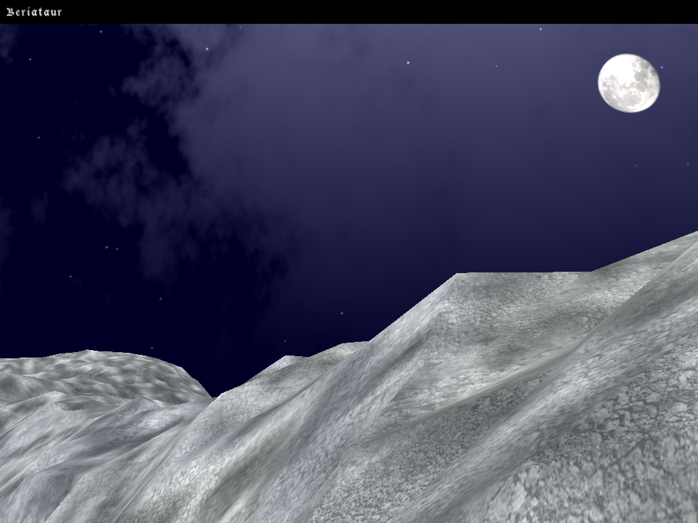
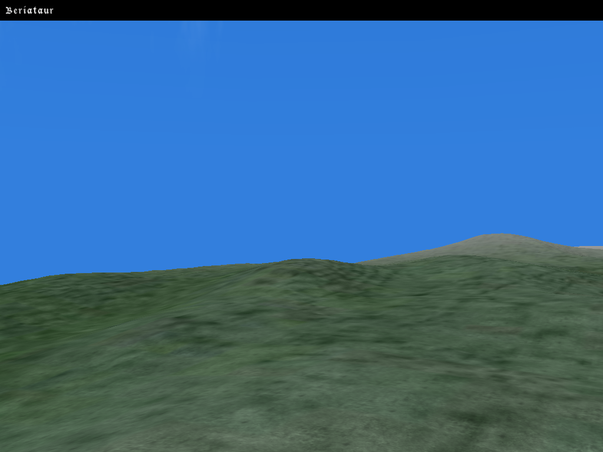
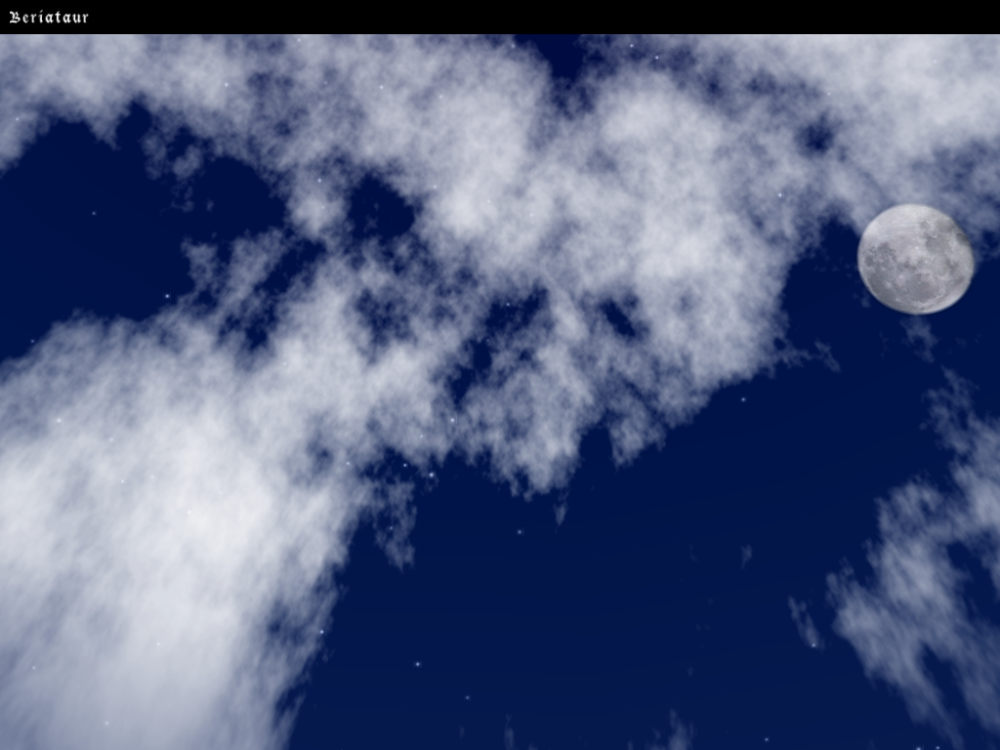
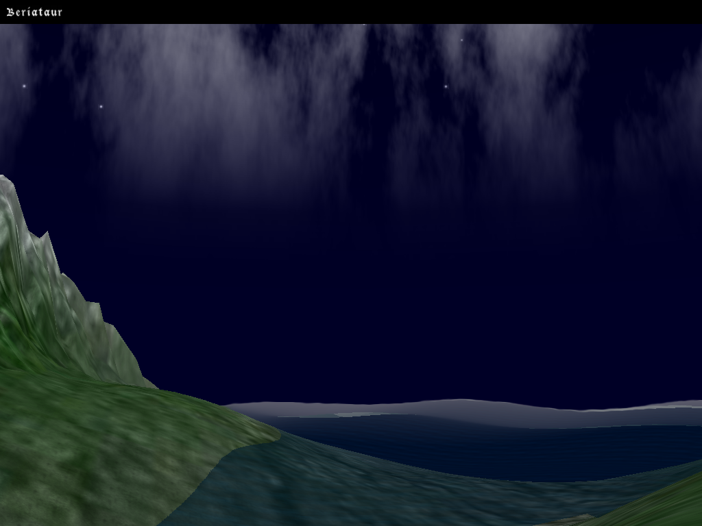
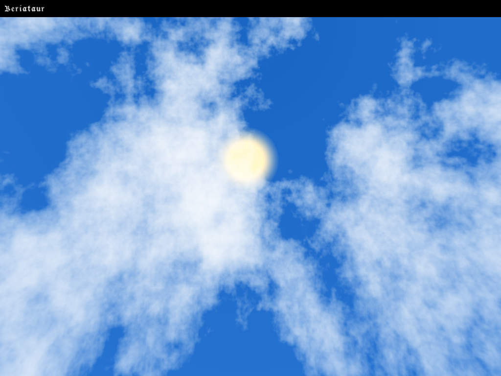
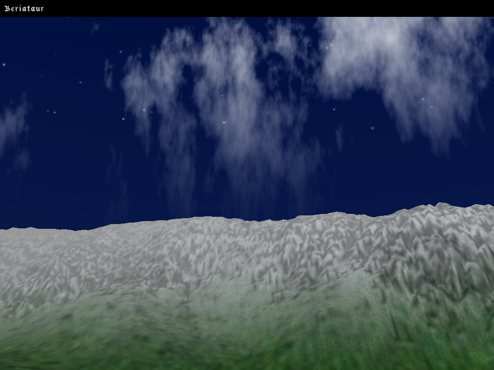

# Lords of Genesis
Massive multiplayer online RPG (discontinued in 2003, when I was 17)

Before finishing high school I was really into Game Development. In this case, I wanted to learn how to create a 3D engine, and a server for an online multiplayer game. I learned a lot but the game itself was discontinued because I didn't have the time or manpower to make it happen all by myself.

The engine mainly uses OpenGL and SDL (simple directmedia layer) so it worked on many platforms (including Windows and Linux). It also uses many other libraries, e.g., to load JPG, XML, and sound files.

The code was basically made from scratch, with the ocassional help of some online tutorials. It includes:
* A client (`engine`):
  * A terrain (heightmap) loader and renderer
  * A window system with some basic widgets
  * A console
  * A skydome, with moving clouds (created with Perlin noise algorithm), setting moon and sun
  * Basic frustum culling using quad-trees
  * A basic networking protocol, implemented from scratch
  * Loading and management of images, bitmap fonts, sound and textures
  * Basic internationalization
* A server (`server`)

_Note: Pardon the notation and lack of "modern" design patterns in the code. This was ages ago. My dial-up connection really limited my learning ;)_

## Screenshots

